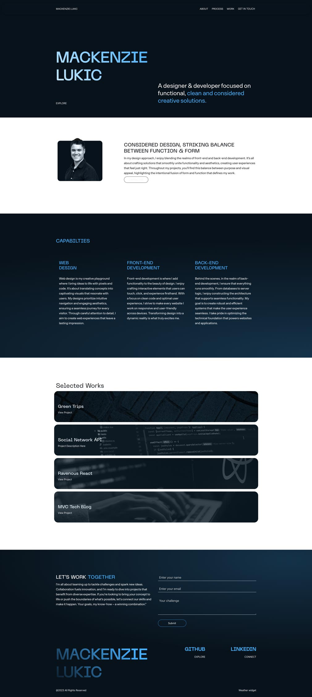

# Mackenzie Lukic, React Portfolio

 Thank you for visiting my development portfiolio. Here, I present a series of applications that I have developed. Each application is accompanied by a brief description and a link to the deployed application. 

 ## Deployed Page
https://mlukicdesign.github.io/ml-react-portfolio/

 ### Why React?

 In a dynamic landscape where technology is a perpetually shifting canvas, React has emerged as my preferred medium for crafting digital experiences. Its modular architecture, coupled with its ability to produce performant and scalable applications, resonates deeply with my development ethos. Through my React-driven initiatives, I not only manifest ideas but also remain attuned to the evolving paradigms of modern web development.

### GitHub Repository
https://github.com/mlukicdesign/ml-react-portfolio

### Technologies Used  
React, React-Boostrap, Framer.motion, React Router, Github Pages, JSX, Adobe Photoshop, Javascript ES6, CSS, HTML. 

### Contact
mlukicdesign@gmail.com
